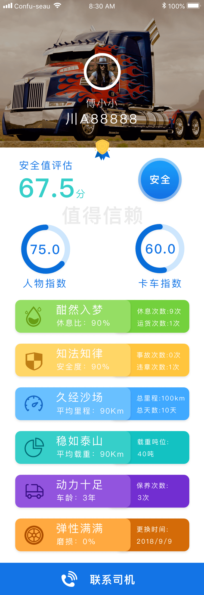

# Truck Driver Secirity Rate 
# Truck Driver Secirity Rate 
Truck driver safety assessment

## 1. Data analysis phase
According to the analysis of the driver's driving behavior, find out the factors affecting the driver's safe delivery behavior, analyze the factors that can cause the delivery safety of the truck, generate a large amount of data, and grade the driver's safety according to the research data.

## 2. Server, using Python+flask+MongoDB
Generate two routes, access the query database, and return the data to the front-end

## 3. Front-end
including two pages, first page to show ten pieces of data about the summary score for the driver
second page is about the details about the driver and truck(anlysed before)

## 4. Screenshot

